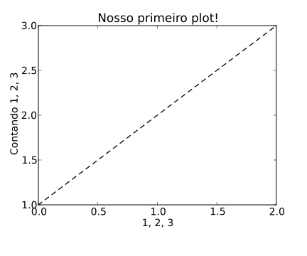
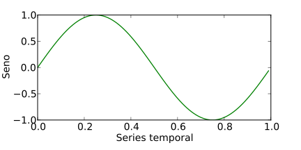
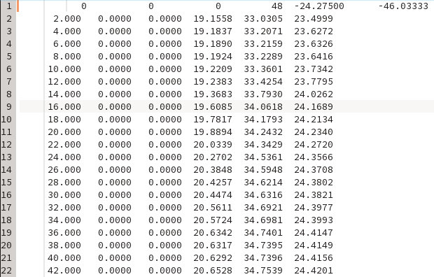
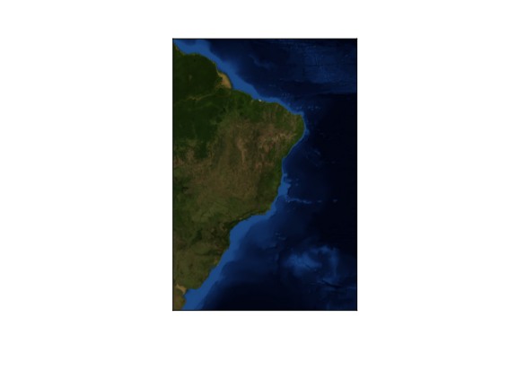
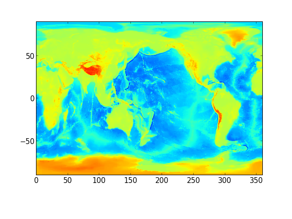
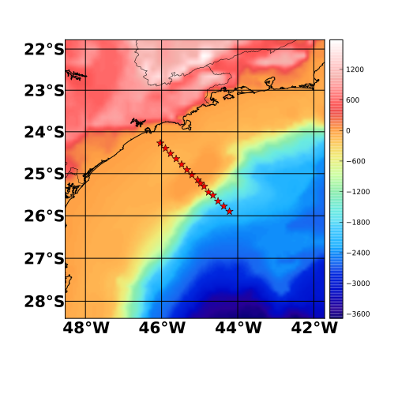
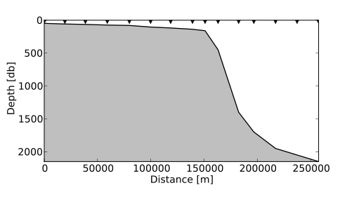
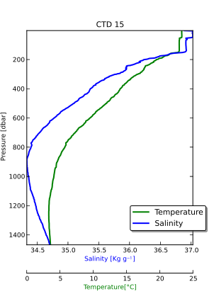

Aula experimental (Python + Hidrografia)
========================================

.notes: Conversa utilizar python com uma linguagem "cola".

**Objetivos**

- Introdução à linguagem de programação Python.
- Exemplos do seu uso para análise exploratória de dados hidrográficos.

*Objetivos específicos*

- Manipular dados hidrográficos.
- Criar gráficos/mapas.
- Plotar diagrama TS.

---

Quebrar a ansiedade
===================
.notes: Explicar o que é o ambiente PyLab

**Primeiro gráfico!**

    !python
    from pylab import *
    plot([1, 2, 3], 'k--')
    xlabel("1, 2, 3")
    ylabel(u"Contando 1, 2, 3")
    title(u"Nosso primeiro plot!")
    gcf().set_size_inches(6, 5)
    savefig('line.svg')

---

---

Namespaces
==========
.notes: import this

**Direto da wikipedia:**

*A namespace (sometimes also called a name scope) is an abstract container or
environment created to hold a logical grouping of unique identifiers or symbols
(i.e., names).*

**O que interessa para nós?**

- Namespaces mantém o código organizado.
- Evita conflitos gerados por funções de mesmo nome.
- Torna o código "declarativo" e consequentemente mais legível.

---

Matlab vs Python (Namespaces)
=============================
.notes: Problemas do Matlab: Preço, reproduzibilidade, abertura de código, sintaxe que favorece código ruim...

Matlab:

    !matlab
    w1 = window(@gausswin, N, 2.5)
    % Opa! O resultados é diferente do que eu esperava. Argh, a minha função
    % window está abaixo da original do Matlab no "path".

Python:

    !python
    from oceans.timeseries import window
    w1 = window(N, 2.5, type='gausswin')
    # Sem dúvida essa era a que eu queria!

---

Imports relativos
=================
.notes: Reproduzibilidade é a palavra chave aqui!

Como vocês já notaram, em Python temos que importar (declarar) tudo que vamos
utilizar.

    !python
    import numpy as np
    import matplotlib.pyplot as plt

    # Um vetor de 0 até (mas não incluso!) 1 em intervalos de 0.01.
    t = np.arange(0.0, 1.0, 0.01)
    # Seno deste vetor.
    y = np.sin(2 * np.pi * t)
    # Plotando usando "OOP".
    fig, ax = plt.subplots(figsize=(6, 3))
    ax.plot(t, y, 'g')
    ax.set_ylabel("Seno")
    ax.set_xlabel("Series temporal")
    ax.set_title("Dados")
    fig.savefig("sine.svg")

---

---

Hidrografia
===========
.notes: Comentar sobre formatos binários como netCDF, HDF, etc.

- Nossos dados estão organizados na pasta **dados**.
- São arquivos ASCII que podem ser abertos em qualquer editor de texto.
- Leia o arquivo "leia_me.txt" para maiores descrições do formato dos dados.

---

Fazendo um mapa com as estações
===============================
.notes: Abrir alguns desses sites, mostrar NumPy4Matlab users.

.notes: Comentar dos vídeos SciPy/PyCon.

**Mas antes import, import e mais import...**

    !python
    # Módulos da "Standard library" do python.
    import os  # Operation System.
    from glob import glob  # "Globbing" de arquivos.

    # http://www.scipy.org/Tentative_NumPy_Tutorial
    import numpy as np  # "Arrays" Numéricas.

    # http://packages.python.org/seawater
    import seawater.csiro as sw  # Equação de Estado da água do mar.

    # http://www.loria.fr/~rougier/teaching/matplotlib/
    import matplotlib.pyplot as plt  # Pacote de plotagem.

    # http://bit.ly/coT4Da
    from netCDF4 import Dataset  # Manipula netCDF (local/remoto).

    # http://matplotlib.org/basemap/
    from mpl_toolkits.basemap import Basemap, shiftgrid, cm  # Mapas.

---

Como ler um arquivo de dados
============================
.notes: Lembrar que formatos mais simples não precisam ser lidos na "unha".

    !python
    fname = '../data/estacao08.dat'
    f = open(fname, 'r')
    lines = f.readlines()
    data = lines[0].strip().split()[3:]
    depth = float(data[0])
    lat = float(data[1])
    lon = float(data[2])
    print("Prof.: %s m\nLongitude: %2.4f deg\nLatitude: %2.4f deg" %
          (depth, lon, lat))

- Prof.: 138.0 m
- Longitude: -45.0500 deg
- Latitude: -25.1517 deg

---

Criando o "objeto" mapa.
========================
.notes: Projeções, banco de dados de linha de costa, imagens, batimetria, etc.

    !python
    llcrnrlon, urcrnrlon = -59.0, -25.0
    llcrnrlat, urcrnrlat = -38.0, 9.0
    m = Basemap(projection='merc',
                llcrnrlon=llcrnrlon,
                urcrnrlon=urcrnrlon,
                llcrnrlat=llcrnrlat,
                urcrnrlat=urcrnrlat,
                lat_ts=20, resolution='i')
    m.bluemarble()

    plt.savefig("map.svg", transparent=True)

---

O famoso Bluemarble da NASA
===========================

---

Lendo dados online de batimetria
================================
.notes: Comentar sobre OOP vs pylab vs pyplot

.notes: Batimetria do etopo5, para etopo2 use:

.notes: http://opendap.ccst.inpe.br/Misc/etopo2/ETOPO2v2c_f4.nc

    !python
    url = 'http://ferret.pmel.noaa.gov/thredds/dodsC/data/PMEL/etopo5.nc'
    etopodata = Dataset(url)
    print(etopodata.variables.keys())

    topoin = etopodata.variables['ROSE'][:]
    lons = etopodata.variables['ETOPO05_X'][:]
    lats = etopodata.variables['ETOPO05_Y'][:]

    # Notaram a diferença na sintaxe de plotagem?
    plt.pcolormesh(lons, lats, topoin)
    plt.axis("tight")
    plt.savefig("topografia.png", dpi=75)

---

---

Optimizando atividades rotineiras
=================================
.notes: Programação funcional vs POO

.notes: List comprehension.

    !python
    def break_lines(line):
        return [float(num) for num in line.strip().split()]

    def get_topo(url, m):
        etopodata = Dataset(url)
        topoin = etopodata.variables['ROSE'][:]
        lons = etopodata.variables['ETOPO05_X'][:]
        lats = etopodata.variables['ETOPO05_Y'][:]
        topoin, lons = shiftgrid(180., topoin, lons, start=False)
        nx = int((m.xmax - m.xmin) / 5000.) + 1
        ny = int((m.ymax - m.ymin) / 5000.) + 1
        return m.transform_scalar(topoin, lons, lats, nx, ny)

---

Lendo um diretório inteiro de dados
===================================
.notes: Tuples, list, dicts, sets, e seus usos.

    !python
    lista = glob(os.path.join('..', 'data', '*.dat'))

['../data/estacao09.dat',
 '../data/estacao04.dat',
 '../data/estacao01.dat',
 '../data/estacao05.dat',
 '../data/estacao11.dat',
 '../data/estacao10.dat',
 '../data/estacao13.dat',
 '../data/estacao03.dat',
 '../data/estacao02.dat',
 '../data/estacao06.dat',
 '../data/estacao08.dat',
 '../data/estacao14.dat',
 '../data/estacao12.dat',
 '../data/estacao15.dat',
 '../data/estacao07.dat']

    !python
    lista.sort()

['../data/estacao01.dat',
 '../data/estacao02.dat',
 '../data/estacao03.dat',
 '../data/estacao04.dat',
 '../data/estacao05.dat',
 '../data/estacao06.dat',
 '../data/estacao07.dat',
 '../data/estacao08.dat',
 '../data/estacao09.dat',
 '../data/estacao10.dat',
 '../data/estacao11.dat',
 '../data/estacao12.dat',
 '../data/estacao13.dat',
 '../data/estacao14.dat',
 '../data/estacao15.dat']

.notes: O módulo os torno o programa portátil entre Windows/Linux/Mac!

---

Iterando nossa lista
====================
.notes: Iterators, generators

    !python
    depth, lat, lon = [], [], []
    for fname in lista:
        with open(fname, 'r') as f:
            lines = f.readlines()
            d, la, lo = break_lines(lines[0])[3:]
            lon.append(lo)
            lat.append(la)
            depth.append(d)

.notes: Usamos a função break_lines() no loop.

.notes: with statement

---

Matlab vs Python (Iteração)
============================
.notes: Indexação vs acesso direto

.notes: Não há end no python.  A indentação marca os blocos.

Matlab:

    !matlab
    for k = 1:length(files)
        files(k).name
    end

Python:

    !python
    for fname in lista:
        print("%s" % fname)

.notes: Mesmo assim precisa de um Index? use enumerate!

---

Juntando tudo
=============
Como rodar um **script**?

.notes: Rodar programa completo.

*run plt_map.py*

    !python
    # -*- coding: utf-8 -*-
    #
    # plt_map.py
    #
    # purpose:  Read all stations and plot a map
    # author:   Filipe P. A. Fernandes
    # e-mail:   ocefpaf@gmail
    # web:      http://ocefpaf.tiddlyspot.com/
    # created:  13-Nov-2012
    # modified: Wed 14 Nov 2012 04:03:00 PM BRST
    #
    # obs: Plot a map and a depth profile for the CTD transect.
    #

    import os
    from glob import glob

    import numpy as np
    import seawater.csiro as sw
    import matplotlib.pyplot as plt
    from netCDF4 import Dataset
    from mpl_toolkits.basemap import Basemap, shiftgrid, cm

    def break_lines(line):
        return [float(num) for num in line.strip().split()]

    def get_topo(url, m):
        etopodata = Dataset(url)
        topoin = etopodata.variables['ROSE'][:]
        lons = etopodata.variables['ETOPO05_X'][:]
        lats = etopodata.variables['ETOPO05_Y'][:]
        topoin, lons = shiftgrid(180., topoin, lons, start=False)
        nx = int((m.xmax - m.xmin) / 5000.) + 1
        ny = int((m.ymax - m.ymin) / 5000.) + 1
        return m.transform_scalar(topoin, lons, lats, nx, ny)

    # Shelf angle.
    def bathymetry_angle(start=0, end=9):
        opposite = depth[end] - depth[start]
        adjacent = dist[end] - dist[start]
        return np.arctan2(-opposite, adjacent) * 180 / np.pi

    lista = glob(os.path.join('..', 'data', '*.dat'))
    lista.sort()

    depth, lat, lon = [], [], []
    for fname in lista:
        with open(fname, 'r') as f:
            lines = f.readlines()
            d, la, lo = break_lines(lines[0])[3:]
            lon.append(lo)
            lat.append(la)
            depth.append(d)

    tangent = bathymetry_angle(0, 9)
    print("Shelf angle: %s" % tangent)

    # Map.
    offset = 2.
    llcrnrlon, urcrnrlon = min(lon) - offset, max(lon) + offset
    llcrnrlat, urcrnrlat = min(lat) - offset, max(lat) + offset

    m = Basemap(projection='merc',
                llcrnrlon=llcrnrlon,
                urcrnrlon=urcrnrlon,
                llcrnrlat=llcrnrlat,
                urcrnrlat=urcrnrlat,
                lat_ts=20, resolution='h')
    fig, ax = plt.subplots(figsize=(20, 20), facecolor='w')
    m.ax = ax

    url = 'http://ferret.pmel.noaa.gov/thredds/dodsC/data/PMEL/etopo5.nc'
    topodat = get_topo(url, m)

    im = m.imshow(topodat, cm.GMT_haxby)
    m.drawstates()
    m.drawcountries()
    m.drawcoastlines()
    m.plot(lon, lat, 'r*', latlon=True)
    cb = m.colorbar(im, 'right', size='5%', pad='2%')
    meridians = np.arange(int(llcrnrlon), int(urcrnrlon), 1.)
    parallels = np.arange(int(llcrnrlat), int(urcrnrlat), 1.)
    kw = dict(fontsize=20, fontweight='demibold')
    m.drawparallels(parallels, labels=[1, 0, 0, 1], **kw)
    m.drawmeridians(meridians, labels=[1, 1, 0, 1], **kw)

    # Profile.
    dist, phaseangle = sw.dist(lon, lat, units='km')
    dist = np.r_[0, np.cumsum(dist)] * 1e3

    fig, ax = plt.subplots(figsize=(12, 9), facecolor='w')
    ax.fill_between(dist, max(depth), depth, color='0.75')
    ax.plot(dist, depth, color='k')
    ax.set_ylim(0, max(depth))
    ax.set_xlim(-5, max(dist) + 10)
    ax.invert_yaxis()
    ax.set_ylabel("Depth [db]")
    ax.set_xlabel("Distance [m]")
    ax.plot(dist, len(dist) * [0], 'kv')
    ax.xaxis.tick_bottom()

    plt.show()

---
Mapa das estações
=================

---
Perfil de batimetria
====================

---

Missão cumprida!
================

Até o momento fomos capazes de ler vários arquivos em um único *loop*, ler
a posição e profundidade das estações e plotar um mapa e um perfil batimétrico
do cruzeiro.

O próximo passo será ler os dados de temperatura e salinidade e plotar perfis
e seções hidrográficas.

Anteriormente nós lemos apenas a primeira linha dos arquivos de dados.
Agora, precisamos ler os dados de T e S.  Para isso vamos usar a função
*loadtxt()* do **NumPy**.

---

Lendo todos os dados
====================

.notes: Você sabem explicar todas as opções utilizadas para ler o arquivo?

    !python
    import numpy as np

    fname = '../data/estacao08.dat'

    P, T, S = np.loadtxt(fname, unpack=True, usecols=(0, 3, 4), skiprows=1)

---

Programa completo
=================

.notes: Rodar programa completo.

*run plt_profiles.py*

    !python
    # -*- coding: utf-8 -*-
    #
    # plt_profiles.py
    #
    # purpose:  Load and plot CTD profiles
    # author:   Filipe P. A. Fernandes
    # e-mail:   ocefpaf@gmail
    # web:      http://ocefpaf.tiddlyspot.com/
    # created:  13-Nov-2012
    # modified: Tue 13 Nov 2012 12:43:58 PM BRST
    #
    # obs:
    #

    import os
    import numpy as np
    import matplotlib.pyplot as plt
    import mpl_toolkits.axisartist as AA
    from mpl_toolkits.axes_grid1 import host_subplot

    font = {'size'   : 9}
    plt.rc('font', **font)

    deg = u"\u00b0"

    #est = raw_input("Enter the CTD station to plot: [01 to 15]: ")
    est = 15
    fname = 'estacao%s.dat' % est
    fname = os.path.join('..', 'data', fname)

    P, T, S = np.loadtxt(fname, unpack=True, usecols=(0, 3, 4),
                         skiprows=1)

    fig = plt.figure(figsize=(4.2, 6))

    ax0 = host_subplot(111, axes_class=AA.Axes)
    new = ax0.get_grid_helper()
    ax0.axis["bottom"] = new.new_fixed_axis(loc="bottom",
                        offset=(0, -40),
                        axes=ax0)
    p0, = ax0.plot(T, P, linewidth=2.0,
                   color='green', label=r'Temperature')

    ax0.set_ylabel("Pressure [dbar]")
    ax0.set_xlabel(u"Temperature[%sC]" % deg)
    ax0.axis["bottom"].label.set_color(p0.get_color())
    ax0.set_title("CTD %s" % est)

    ax1 = ax0.twiny()
    new = ax1.get_grid_helper()
    ax1.axis["top"] = new.new_fixed_axis(loc="bottom",
                                                    offset=(0, 0),
                                                    axes=ax1)
    p1, = ax1.plot(S, P, linewidth=2.0,
                   color='blue', label=r'Salinity')

    ax1.set_xlabel("Salinity [Kg g$^{-1}$]")
    ax1.axis["top"].label.set_color(p1.get_color())
    ax1.invert_yaxis()
    ax1.axis("tight")

    ax0.legend(shadow=True, fancybox=True, numpoints=1,
            loc=2, bbox_to_anchor=(.6, 0.2))

    fig.savefig("CTD_profile_%s.svg" % est, transparent=True)

    plt.show()

---

Perfil de CTD da estação 15
============================

---

Diagrama TS
===========

Para fazer um diagrama TS e seções precisamos lidar com todas as estações de
uma vez.  Porém, cada estação termina em uma profundidade diferente, formando
um vetor de dados de comprimento diferente.  A forma mais fácil de "alinhar"
esse dados é com o módulo **pandas**

    !python
    from pandas import DataFrame
    df1 = DataFrame([1, 2, 3, 4, 5], index=[1, 2, 3, 4, 5], columns=['01'])
    df2 = DataFrame([1, 2, 3, 4, 5, 6, 7, 8, 9, 10],
                    index=[1, 2, 3, 4, 5, 6, 7, 8, 9, 10], columns=['02'])

    print(df1.join(df2, how='right'))

---

Programa completo
=================
.notes: Rodar programa completo.

run *plt_TS.py*

    !python
    # -*- coding: utf-8 -*-
    #
    # plt_TS.py
    #
    # purpose:  Plot a TS diagram
    # author:   Filipe P. A. Fernandes
    # e-mail:   ocefpaf@gmail
    # web:      http://ocefpaf.tiddlyspot.com/
    # created:  13-Nov-2012
    # modified: Tue 13 Nov 2012 01:11:33 PM BRST
    #
    # obs:
    #

    import os
    from glob import glob

    import numpy as np
    import seawater.csiro as sw
    import matplotlib.pyplot as plt

    from pandas import DataFrame

    def basename(fname):
        return os.path.splitext(os.path.basename(fname))

    def read_station(fname):
        P, T, S = np.loadtxt(fname, unpack=True, usecols=(0, 3, 4),
                             skiprows=1)
        column = basename(fname)[0]
        return (DataFrame(T, index=P, columns=[column]),
                DataFrame(S, index=P, columns=[column]))

    lista = glob(os.path.join('..', 'data', '*.dat'))
    lista.sort()

    first = lista.pop(0)
    tmp, sal = read_station(first)

    for fname in lista:
        T, S = read_station(fname)
        tmp = tmp.join(T, how='right')
        sal = sal.join(S, how='right')

    Te = np.arange(0, 32, 2)
    Se = np.arange(32, 38.25, 0.25)

    Sg, Tg = np.meshgrid(Se, Te)
    cnt = np.arange(20, 34)

    sigma_theta = sw.pden(Sg, Tg, 0, 0) - 1000

    deg = u"\u00b0"

    fig, ax = plt.subplots(figsize=(6, 6))
    ax.plot(sal, tmp, 'k.')
    ax.set_ylabel("Temperatura %sC" % deg)
    ax.set_xlabel("Salinidade [g kg$^{-1}$]")

    cs = ax.contour(Se, Te, sigma_theta, colors='black', levels=cnt)
    ax.clabel(cs, fontsize=9, inline=1, fmt='%2.1f')
    ax.axis([31.8, 37.2, 0.0, 30.0])

    fig.savefig("TS_diagram.svg", transparent=True)

    plt.show()

---

Diagrama TS espalhado
=====================

